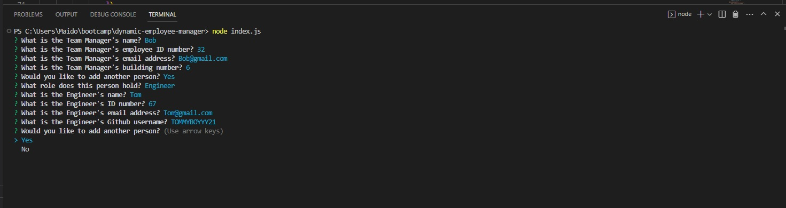

# dynamic-employee-manager

## Description

The motivation behind this project was to practice and clarify concepts and understanding related to the use of nodeJS in the specific areas of classes, constructors and testing. Specifically, this portfolio's construction allowed me to practice the use of dependencies such as inquirer, jest and fs, the usage of classes as a part of object-oriented programming, the use of "this", constructor functions, subclasses and the writing of basic tests. This challenge forced me to go over concepts that I hadn't really understood the first time I covered them in order to make it work. I tried to keep it as simple as possible, whilst fulfilling all of the acceptance criteria, which I have at least partially succeeded in.

## Table of Contents

- [Description](#description)
- [Usage](#usage)
- [Deployment](#deployment)
- [Credits](#credits)
- [License](#license)

## Installation

Use the command npm install to install the required dependencies in the integrated terminal prior to use.

## Usage

Upon entering the command node input.js into the integrated terminal the user will be prompted with several questions, the answers to the first of which will generate an employee card based on the Team's manager.
The user will subsequently be prompted to add more employees based on their roles as either engineers or interns.
After the user is satisfied they have added cards for all of the employees in the team, the script will generates a html file containing the information displayed on cards.

Screenshot:

## Deployment

A link to video of the App's operation:
[Video](https://drive.google.com/file/d/1_V1XLi-y0W79v-Fr5IDq93sCda5z95Lm/view)

## Credits

100% of the work here is my own aside from the use of Jest, FS and Inquirer.

Credit also to my teachers, as without them this would not have been possible.

## License

Licensed under the MIT license.
